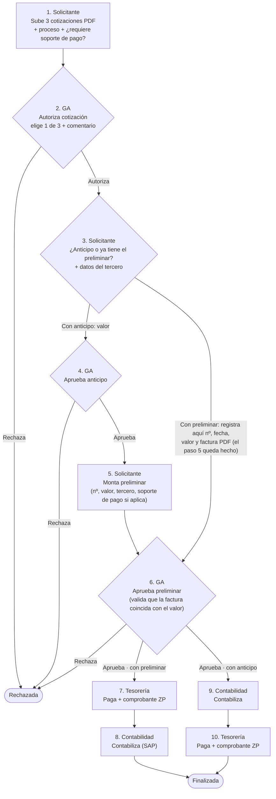
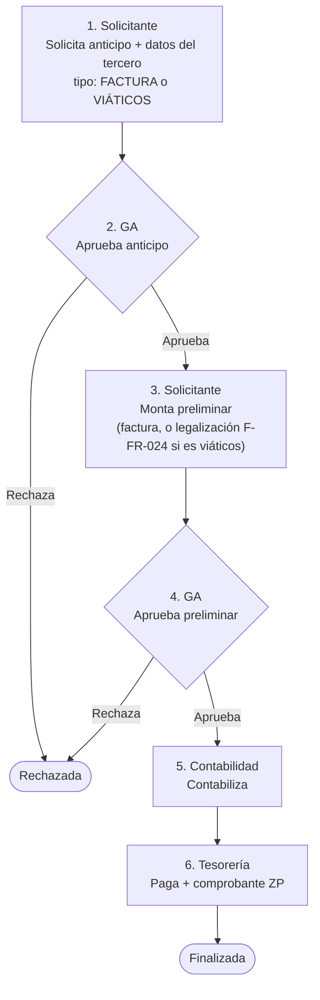
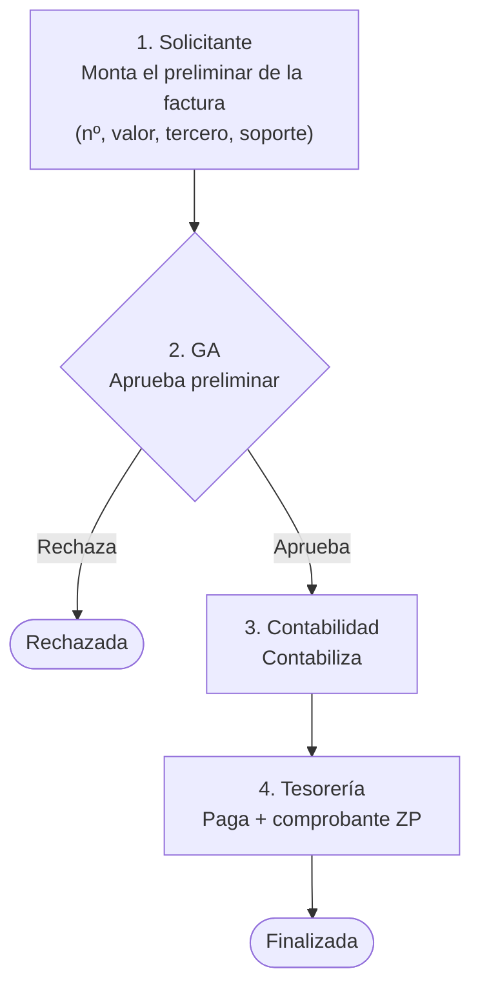

# Flujos del control de gastos

Este documento describe cómo avanza una solicitud de gasto, quién participa en cada paso y
cómo se configuran los flujos por organización. Los flujos que aparecen aquí son los
**predeterminados** que crea `database/gastos.sql`; cada uno se puede cambiar desde la
pantalla **Flujos** sin tocar código.

## 1. Conceptos

| Concepto | Qué es |
|---|---|
| **Tipo de flujo** | `COTIZACION`, `ANTICIPO` o `FACTURA`. Cada tipo tiene sus propios pasos y son independientes entre sí. |
| **Paso** | Una acción con un responsable y una condición. Se ejecuta en orden. |
| **Acción** | Qué hace el paso (subir cotizaciones, aprobar, contabilizar…). Define el formulario que se muestra. |
| **Responsable** | Quién ejecuta el paso: **el solicitante**, **un rol** (`T_ROLES`) o **un usuario específico**. |
| **Condición** | Cuándo aplica el paso (siempre, solo si hay anticipo, solo si el anticipo es por viáticos…). Si no se cumple, el paso se **omite**. |
| **Alcance** | El flujo aplica a **una organización** (1000, 2000…) o a todas, y vale para todas las oficinas de esa organización. |
| **Variante** | Puede haber varios flujos activos del mismo tipo. Al crear la solicitud el usuario **elige** cuál usar; si solo hay uno, se usa directo. Un flujo de una organización con el **mismo nombre** que uno general lo reemplaza para esa organización. |

### Roles que participan

| Quién | Qué hace |
|---|---|
| **Solicitante** (cualquier usuario, departamento o rol) | Crea la solicitud, sube cotizaciones, define el anticipo y monta el preliminar. |
| **Gerencia administrativa (GA)** | Autoriza cotizaciones y aprueba anticipos y preliminares. |
| **Contabilidad** | Contabiliza: monta el número de contabilización y, si aplica, la causación de compensación (consolidación anticipo vs. factura legalizada). |
| **Tesorería** | Paga: monta el número de comprobante ZP, la fecha de pago y el comprobante en PDF. Cierra la solicitud. |

> Los roles concretos (GA, Contabilidad, Tesorería) se asignan en **Flujos**, por flujo y organización.
> Al ejecutar `gastos.sql` se intentan enlazar por el título del rol (`GERENCIA…ADMIN`, `CONTAB`, `TESOR`).

### Estados

- **Solicitud:** `EN_CURSO` → `FINALIZADA` | `RECHAZADA` | `CANCELADA`.
- **Paso:** `PENDIENTE` → `ACTUAL` → `COMPLETADO` | `RECHAZADO`, o `OMITIDO` si su condición no se cumple.
- Un **rechazo** cierra la solicitud (queda `RECHAZADA` con el comentario del que rechazó).
- El **solicitante** puede cancelar mientras la solicitud siga en curso.

## 2. Flujo de COTIZACIÓN

Un solo flujo. Después de que GA autoriza la cotización, el solicitante decide **si necesita anticipo o si ya
tiene el preliminar**; según eso el flujo sigue por una de dos ramas.

Detalles:

- **Paso 1:** las tres cotizaciones son obligatorias y solo se aceptan **PDF** (extensión, firma `%PDF` y tipo MIME se validan). El proveedor y el valor de cada cotización son opcionales pero ayudan a GA a decidir.
- **Paso 3:** el solicitante responde «¿Necesitas anticipo?» y registra los datos del tercero (NIT, razón social, celular, correo, cargo, centro de costos; se pueden traer de `T_TERCEROS`).
  - **Sí:** indica el valor del anticipo (**por cotización**) y sigue la aprobación del anticipo (paso 4).
  - **No, ya tengo el preliminar:** registra ahí mismo el **número de preliminar, la fecha y el valor de la factura y adjunta solo la factura en PDF**. Es lo mismo que pide el paso 5, que queda como realizado, así que la solicitud pasa directo a la aprobación del preliminar por GA (paso 6). Antes de enviar, el sistema avisa a qué paso se pasa y cuáles se omiten.
- **Paso 4:** solo si hay anticipo (`ANTICIPO_SI`); si no, se omite.
- **Paso 5 (solo con anticipo):** número de preliminar, fecha y valor de la factura, factura en PDF (obligatoria) y el soporte de pago si en el paso 1 se marcó *requiere soporte de pago*. Los datos del tercero llegan prellenados con los del paso 3.
- **Paso 6:** GA valida que la factura corresponda al valor aplicado antes de que se pague.
- **Pasos 7 a 10:** el orden final depende de la rama. **Con preliminar** (`ANTICIPO_NO`): primero paga Tesorería (7) y luego contabiliza Contabilidad (8). **Con anticipo** (`ANTICIPO_SI`): primero contabiliza Contabilidad (9) y luego paga Tesorería (10). Los pasos de la otra rama aparecen como «No aplica». El orden de cada rama se puede cambiar en **Flujos**.

## 3. Flujo de ANTICIPO

Hay dos variantes, según el tipo de anticipo que elija el solicitante en el paso 1.

- **Por factura:** el solicitante indica el **valor** del anticipo. Después debe montar el preliminar (pasos 3 y 4, condición `ANTICIPO_FACTURA`).
- **Por viáticos:** se diligencia el **formato F-FR-023 (solicitud de viáticos)**, que se abre en un **modal** con el diseño del formato impreso:
  - fecha y dependencia;
  - datos de quien solicita (prellenados con los del usuario);
  - motivo de la solicitud y fechas de salida y de regreso;
  - valor presupuestado por concepto y total solicitado;
  - autorización de descuento (art. 150 y 151 CST).

  Validaciones:
  - la salida no puede ser anterior a hoy y el regreso no puede ser anterior a la salida;
  - «Otros» con valor exige decir cuál;
  - el total debe ser mayor que cero;
  - la autorización es obligatoria.

  El total se recalcula en el servidor.
- **Legalización (viáticos):** en el paso del preliminar, en lugar de la factura se diligencia el **formato F-FR-024**, también en un modal con el diseño del formato:
  - filas con fecha, centro de costo, doc y ciudad y detalles;
  - un valor en una o más columnas (Transp, Bus/taxis, Hotel, Aliment, Atención, Gasolina, Servicios, Otros) y el total diario de la fila;
  - todos los soportes, incluido el comprobante de reintegro si lo hay, se suben en **un solo PDF**.

  El sistema calcula:
  - **retefuente descontada:** 2,5 % de cada valor de hotel o alimentación superior a $110.000;
  - **total cuenta de gastos** = suma − retefuente;
  - **saldo A/F** = suma recibida − total cuenta de gastos. Si es positivo, el saldo es a favor de DF Roma; si es negativo, a favor del empleado.

  Validaciones:
  - cada fecha debe estar dentro del viaje (se admite un día antes y uno después) y no puede ser futura;
  - cada fila necesita detalle y al menos un valor.

  Si pasaron más de 30 días desde el regreso, se muestra una advertencia.

  Solo el solicitante diligencia estos formatos. Gerencia administrativa y los administradores los abren con **«Ver formato»** en solo lectura y, si no aprueban, deben dejar la observación.
- **Preliminar con factura:** además de número, fecha, valor y factura en PDF, se indica si **el pago sale de un fondo** y de cuál (**Fondo Roma** o **Fondo proveedores**). Tesorería lo ve al pagar.

Los valores (tope y tasa de retefuente, días de plazo) se configuran en `GasConfig`.

## 4. Flujo de FACTURA

## 5. Armar o cambiar un flujo

En **Flujos** (solo roles administradores) se puede:

1. Crear un flujo nuevo o editar uno existente.
2. Elegir el **tipo**, el **nombre** (identifica la variante) y la **organización** (1000, 2000 o todas).
3. Agregar, quitar y **reordenar** pasos.
4. Por paso: elegir la **acción**, ponerle nombre, decidir **quién lo ejecuta** (solicitante, rol o usuario) y **cuándo aplica**.

Reglas:

- El **nombre** no puede repetirse dentro del mismo tipo y organización. Puede haber varias variantes activas del mismo tipo.
- El primer paso debe ser del solicitante (es quien arranca la solicitud).
- Una solicitud **no se puede crear** si su flujo tiene pasos de rol/usuario sin responsable.
- Al crear una solicitud, los pasos se **copian** (`T_GAS_SOLICITUD_PASOS`): cambiar un flujo después **no altera** las solicitudes que ya están en curso.

### Acciones disponibles

| Acción | Ejecuta (sugerido) | Qué registra |
|---|---|---|
| `SUBIR_COTIZACIONES` | Solicitante | 3 PDF, proceso, ¿requiere soporte de pago? |
| `AUTORIZAR_COTIZACION` | Rol | Cotización elegida + comentario, o rechazo |
| `DECISION_ANTICIPO` | Solicitante | ¿Anticipo? (valor) o, si ya tiene el preliminar, el preliminar y la factura (deja hecho «Montar preliminar») + tercero |
| `SOLICITAR_ANTICIPO` | Solicitante | Tipo (factura/viáticos), valor o formulario de viaje, tercero |
| `MONTAR_PRELIMINAR` | Solicitante | Nº de preliminar, fecha y valor de la factura, tercero, factura PDF, soporte de pago |
| `APROBAR` | Rol | Aprobar o rechazar con comentario (sirve para anticipos y preliminares) |
| `CONTABILIZAR` | Rol | Nº de contabilización, causación de compensación |
| `PAGAR` | Rol | Nº comprobante ZP, fecha de pago, comprobante PDF |

### Condiciones disponibles

`SIEMPRE`, `ANTICIPO_SI`, `ANTICIPO_NO`, `ANTICIPO_FACTURA`, `ANTICIPO_VIATICOS`, `ANTICIPO_COTIZACION`.

Para agregar una **acción nueva** hay que sumar su entrada en `GasCatalogo::acciones()`, un manejador
`hNombreAccion()` en `GasMotor` y su formulario en `lib/js/gastos/pasos.js` (`Pasos.FORMS`).
`php tests/logica.php` verifica que cada acción del catálogo tenga manejador.

## 6. Supuestos que conviene confirmar

- **Formulario de gastos de viaje:** las líneas son *concepto / descripción / cantidad / valor unitario*
  con los conceptos de `GasCatalogo::conceptosViaticos()`. Ajustar si el formato oficial pide otros campos.
- **Anticipo en el flujo de cotización:** se asume que, tras aprobar el anticipo, el solicitante monta el
  preliminar y todo se contabiliza y paga al final (como se describió). Si tesorería debe pagar el
  anticipo antes, se agrega un paso `PAGAR` con condición `ANTICIPO_SI` desde **Flujos**.
- **Rechazo:** cierra la solicitud. Si se prefiere "devolver al solicitante para corregir", es un cambio puntual en `GasMotor::ejecutar`.
- **Soporte de pago:** se exige al montar el preliminar cuando se marcó *requiere soporte* en la cotización.
